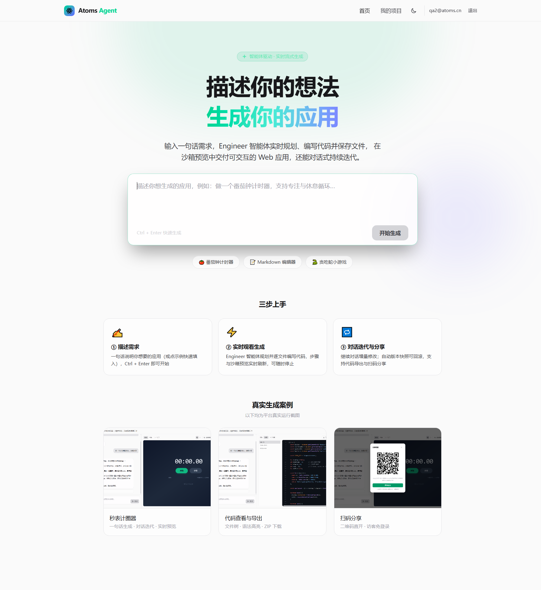
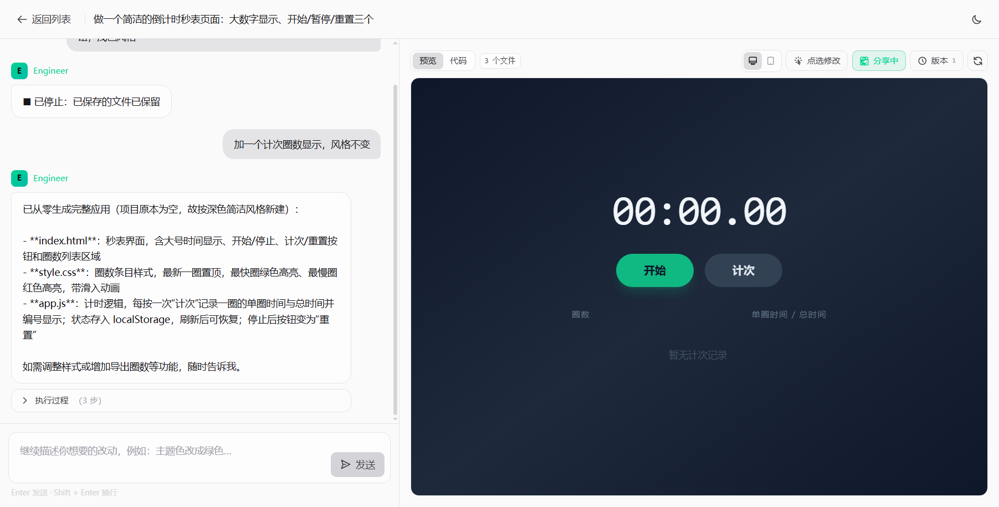
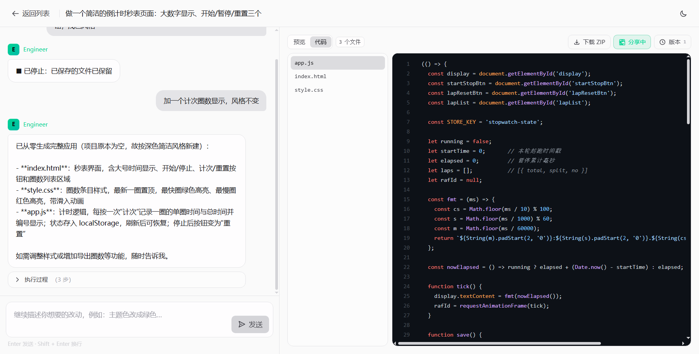
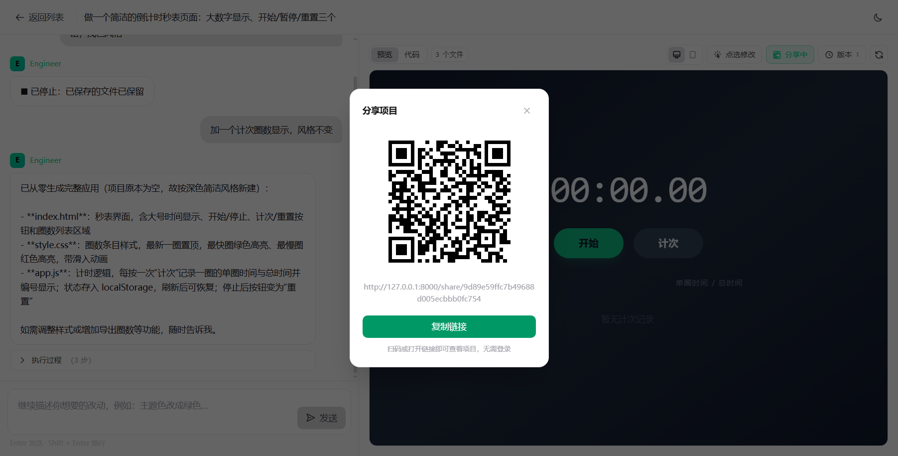

# Atoms Agent Demo

> 类 [Atoms](https://atoms.ai) 的 AI Agent 应用生成平台 — 输入一句话需求，智能体实时生成可在浏览器中直接交互的 Web 应用。

**在线体验**：https://s4pnngk3fusjaesdsgkhc.apigateway-cn-beijing.volceapi.com/ （火山引擎 veFaaS 部署，可注册账号真实生成）

## 效果一览

输入「做一个番茄钟计时器」→ Engineer 智能体规划任务、编写文件（过程逐步直播）→ 右侧沙箱实时预览 → 继续对话「主题色改成紫色」增量迭代 → 版本自动快照、可随时回滚 → 一键分享只读链接、导出 ZIP。

首页自上而下：需求输入 Hero → 三步上手引导 → 真实生成案例 → **平台能力**（十二项核心功能点 + 一句话实现方案罗列，与下方完成度清单同源）。

### 系统截图

| 首页（三步上手 + 真实案例展示） | 工作台（对话生成 + 实时预览） |
|---|---|
|  |  |

| 代码查看（文件树 + 语法高亮） | 扫码分享（二维码直开） |
|---|---|
|  |  |

> 截图存于 `client/public/screenshots/`，首页「真实生成案例」区引用同源文件（线上部署后自动可用）。

## 技术栈

| 层 | 选型 | 说明 |
|---|---|---|
| 前端 | Vue 3 + Vite + TypeScript + Pinia + TailwindCSS | SPA，`client/` |
| 后端 | Python 3.12+ / FastAPI + sse-starlette | REST + SSE，`server/` |
| 智能体 | [deepagents](https://github.com/langchain-ai/deepagents)（LangChain 生态） | 内置规划 todo / 工具调用 / 子代理 |
| LLM | 智谱 GLM（Anthropic 兼容端点），`LLM_*` 环境变量一键换模型 | 兼容 OpenAI 协议端点 |
| 存储 | SQLite + SQLAlchemy（`DATABASE_URL` 可切 PostgreSQL） | 消息 / 文件集 / 版本快照 |

## 快速开始

```bash
# 1. 后端
cd server
pip install -r requirements.txt
cp .env.example .env   # 填入 LLM_API_KEY 等
uvicorn app.main:app --port 8000

# 2. 前端（开发模式，proxy 已指向 8000）
cd client
npm install && npm run dev

# 生产模式：npm run build 后由后端同端口托管 client/dist
```

环境变量见 `server/.env.example`：`DATABASE_URL` / `LLM_PROVIDER` / `LLM_BASE_URL` / `LLM_API_KEY` / `LLM_MODEL`。

## 完成度清单

### P0 核心闭环（全部完成，真实 LLM 端到端实测）

- **R1 需求输入与项目创建**：首页输入 → 创建项目 → 跳转工作台自动开始首次生成
- **R2 流式生成与过程可视化**：deepagents 的 todo 规划与工具调用经 SSE `step` 事件实时渲染步骤卡片，文件经 `save_file` 工具结构化落库（非脆弱的整包 JSON）
- **R3 沙箱实时预览**：`/preview/{id}` 组装自包含 HTML，iframe `sandbox` 隔离加载；文件落库即时刷新，应用内交互真实可用（实测番茄钟真实计时、贪吃蛇键盘操控、倒计时器秒级递减）
- **R4 对话式增量迭代**：follow-up 携带当前文件上下文增量修改，未提及文件不变（实测「改主题色」仅改 `style.css`、「改标题」仅改 `index.html`）
- **R5 持久化与项目列表**：项目 / 消息 / 文件 / 版本全部落库，刷新或从列表重开完整恢复；SQLAlchemy 驱动，换库仅改连接串
- **R6 错误处理与重试**：LLM 失败显示错误卡片，一键重试；服务端**原子提交**——失败路径文件不落库，无半成品脏数据
- **R7 注册/登录与多用户隔离**：邮箱密码注册（pbkdf2）+ HMAC 签名 Cookie 会话；项目严格归属 owner（跨用户列表不可见、直连 API 404）；分享链接与预览访客免登录
- **R8 消息队列与 Stop**：生成中发送自动入队（可删除）、本轮结束自动依序执行；Stop 协作式中断——取消检查点下沉到流循环 chunk 级（点击即停，延迟≈一个 token），已写入文件保留落库（进度快照可回溯），队列自动接续下一条
- **深/浅主题切换**：语义色 token（base/surface/line/ink）驱动，localStorage 持久化，全组件自适应
- **代码语法高亮**：highlight.js 按扩展名识别语言（HTML/CSS/JS/TS/JSON/MD/Python），深色代码底两主题通用，带行号
- **Issue 自修复**：预览运行时错误实时捕获（window.onerror / unhandledrejection）→ 聊天流 Issue 卡 → 一键「自动修复」走生成链路闭环，Agent 定位并修正代码后预览自动恢复
- **Design Mode 点选修改**：预览工具栏开启后 hover 高亮、点选元素 → 需求输入框自动回填元素描述（标签/id/class/文本），精准迭代"改哪个元素"
- **高可用**：SQLite WAL 并发读写不阻塞；LLM 请求 120s 超时 + 自动重试；生成任务 SSE 断线自动重连（多端同步直播，离开页面回来恢复进度）

### 平台工程增强（第二轮迭代，已上线）

- **R16 同用户多设备实时同步**：`GET /api/projects/{id}/events` 项目事件长连接——活跃生成重放快照 + 直播；空闲时挂项目 hub 等待 `sync` 通知。另一台设备（手机/电脑/另一标签页）发起生成时，本设备自动拉取新消息并重连进入直播，全程无需刷新
- **R17 生成并发池**：信号量控制全局并发生成数（`MAX_CONCURRENT_GENERATIONS=3`，可配），超出的请求排队并实时广播位次——页面顶部显示「排队中 · 第 N 位」，排队中可一键取消；15 分钟排队超时兜底
- **R18 project_id 雪花算法**：53 位（42 位毫秒时间戳 + 5 位机器 + 6 位序列），JS Number 精度安全无需字符串化；`MACHINE_ID` 环境变量多实例错开；SQLite 存量小 id 天然兼容、零迁移
- **R19 分享二维码**：开启分享弹层展示二维码（前端 qrcode 生成，白底保证扫码对比度）+ 链接 + 复制按钮，扫码免登录查看
- **R20 Stop 提速**：取消检查点从工具回调下沉到 engineer 流循环逐 chunk 检查，Stop 由「等下一个工具调用」变为「等下一个 token」
- **R21 LLM 请求优化（前缀缓存 + 上下文压缩）**：
  - *前缀缓存*：Anthropic 端点给请求尾块打缓存断点——system prompt + 工具定义 + 已累积对话整体进入服务端前缀缓存（KV Cache）；deepagents 工具循环每步重传全量历史，命中缓存显著降低 input token 与首 token 延迟（`LLM_PROMPT_CACHE=0` 可关）。OpenAI 兼容端点由服务端自动命中前缀缓存。实现上以 `ChatAnthropic` 子类覆写 `bind_tools` 链式附加 `cache_control`——不能直接用 `bind()` 产物：deepagents 的 `resolve_model` 只认 `BaseChatModel`，bind 产物会被误当 `"provider:model"` 字符串 spec 解析而崩溃
  - *上下文压缩*：对话历史以 KB 级摘要注入（首条原始需求 + 最近两轮，单条截断）而非全量；文件集总量超 `MAX_CONTEXT_CHARS`（默认 60k 字符）时自动压缩——入口 index.html 全量保留、其余文件保留头部并标注省略（明确告知截断文件无需重写）
- **R23 多端/多项目运行态隔离（第四轮迭代）**：修复多端同步上线后的状态串扰——运行态（生成中/停止中/排队位次）属项目级而非页面级全局态：切项目即重置并中断旧 chat 流消费（后端生成继续，切回经 `/events` 重连直播）；发起端与观看端角色分离——发起端 chat 流即数据源（对 sync 重连豁免，杜绝双 run 卡与步骤重复），观看端直播收尾但不续跑消息队列（队列只属发起端，多端续跑会双发）；`stop()` 带 10s 超时兜底防「停止中」卡死。多端各自的生成/停止状态互不干扰

### P1 延展能力（四项全部完成）

- **R7 版本快照与回滚**：每次生成成功自动存快照；版本时间线 UI 一键回滚，文件 + 预览恢复，回滚动作本身再落一条新快照（可再撤销）
- **R8 PC/移动视口切换**：预览容器桌面全宽 / 手机 375px 居中切换
- **R9 一键分享**：公开只读链接，访客免登录可交互；关闭后链接即刻失效（share_id 稳定复用，关闭再开启链接不变）
- **R10 代码查看与导出**：文件树 + 带行号代码视图；当前文件集一键打包 ZIP 下载

## 实现思路与关键取舍

**1. 结构化生成优先于「整包 JSON」**。让智能体输出一个大 JSON 再解析是最脆弱的路线：LLM 输出格式漂移、长内容截断、无法流式。本 Demo 给 Engineer Agent 注册 `save_file(filename, content)` 工具，每个文件经工具调用**独立落库并即时推送** `files` 事件——天然结构化、天然增量流式，预览可在生成中途就刷新。

**2. 生成事件流的桥接**。deepagents 的执行是同步阻塞的（真实生成分钟级），而 SSE 需要随产随推。用 daemon 线程跑生成、`queue.Queue` 桥接事件，`sse-starlette` 消费同步迭代器逐条下发。step 事件分 `todo / tool / message` 三类，前端分别渲染为步骤卡片与打字机流式文本；落库时 message 类 token 合并为单条，避免消息表膨胀。

**3. 原子提交保证无脏数据**。生成过程中文件先进 pending dict（仅用于即时预览），**只有整轮成功才 `set_files` 落库**。失败/中断不产生半成品状态，重试安全。

**4. 预览组装而非构建**。生成物限定为自包含 Web 应用（HTML/CSS/JS，可用 Tailwind CDN），后端把文件集组装为单页 HTML 供 iframe `sandbox` 加载，省掉在线构建环节的复杂度与安全面。这是 Demo 取舍：换来零构建实时预览，代价是不支持多文件工程构建（见后续扩展）。

**5. 版本快照用「全量 JSON」而非 diff**。SQLite 场景下单项目文件集很小（几十 KB），全量快照实现简单、回滚零计算、天然一致；diff 方案省空间但引入合并复杂度，对 Demo 是过度设计。

**6. 分享链接的失效语义**。`is_shared` 开关即时生效（访客侧 404），`share_id` 对项目稳定复用——关闭再开启，链接不变，作者侧体验更连贯。

**7. 换库 / 换模型零业务侵入**。存储经 SQLAlchemy，`DATABASE_URL` 一改即可切 PostgreSQL；LLM 经 LangChain 封装 + 环境变量，支持 Anthropic 兼容（智谱 Coding Plan）与 OpenAI 兼容双协议端点。

**8. 项目事件总线：一条长连接承载「直播 + 空闲通知」**。每个项目维护活跃生成上下文（步骤累积 / 订阅队列 / 取消标志）与空闲订阅 hub：`GET /events` 连接在有活跃生成时重放快照并直播，结束后不关闭而是转入 hub 挂住（sse-starlette 周期 ping 保活）；项目发生 chat/回滚/分享等变更时向 hub 广播 `sync` 事件，前端据此拉取或断开重连进直播——多设备实时同步无需 WebSocket、无需轮询，同一条 SSE 通道复用两种形态。

**9. 并发池用信号量而非任务队列**。`BoundedSemaphore` 天然支持「立即获取或等待」，等待中以 5s 轮询检查取消标志（排队可取消）、位次变化实时广播给所有订阅连接。serverless 实例资源有限，默认上限 3 可经 `MAX_CONCURRENT_GENERATIONS` 调整；排队超时 15 分钟兜底防永久滞留。

**10. 雪花 ID 严格压在 53 位**。标准雪花是 64 位（JS Number 会丢精度，通常要字符串化 + 前后端配合）。本 Demo 裁剪为 42 位毫秒时间戳（139 年）+ 5 位机器 + 6 位序列 = 53 位内，API JSON 直传 int，前端零改动；SQLite INTEGER 亲和性对存量自增小 id 天然兼容，旧数据零迁移。

**11. 运行态归属项目而非页面（多端角色分离）**。多设备同步上线后暴露的典型串扰：全局的「生成中/停止中」标志、发起端与观看端重复渲染 run 卡、多端各自续跑队列导致双发。修复定式是**运行态属项目级**——切项目重置 + 中断旧流（`AbortSignal`）；**发起端/观看端角色分离**——chat 流所在页是唯一数据源（sync 重连豁免、队列续跑唯一责任人），其余端只经 `/events` 直播消费；辅以停止超时兜底。「谁发起、谁收尾」是防多端双发的关键约束。

**12. 前缀缓存的注入点要尊重框架的模型类型契约**。`bind(cache_control=…)` 是官方推荐的 Anthropic 缓存标记方式，但其产物是 `RunnableBinding` 而非 `BaseChatModel`——deepagents 的 `resolve_model` 对非 `BaseChatModel` 对象按 `"provider:model"` 字符串 spec 解析（直接 `partition` 崩溃）。教训：**带工具绑定的代理框架里，凡是要传给框架的模型对象，必须保持框架期望的类型**；缓存标记这类「每次调用都要附加的 kwargs」应通过子类覆写 `bind_tools` 在框架内部的绑定点上链式附加，而非在入口处 bind 好再传入。

## 后续扩展与优先级

按「对笔试评估价值 / 实现成本」排序：

1. **画廊与 Remix**（P2）— 公开项目画廊 + 一键复制为新项目，体现平台「生成 → 传播 → 再创作」闭环
2. **用户自定义模型**（P2）— 用户级 LLM 配置（自带 API Key / 供应商 / 模型选择），平台侧多模型路由与用量计量
3. **用户定制能力**（P2）— 技能（自定义 system prompt / 领域模板）、Workflow（编排多步生成流水线）、插件生态（GitHub / Figma 等外部连接器，Agent 经 OAuth 调用第三方能力）
4. **社区与会员**（产品化）— 作品广场与点赞/评论/Fork、创作者主页；会员体系（免费额度 + Pro 更高速率/更大并发池/更长上下文），对齐 Atoms 的增长与商业化形态
5. **多文件工程构建**（架构演进）— 预览从「单页组装」升级为沙箱构建服务（esbuild/容器），解锁 React 多文件工程
6. **生成过程可视化深化** — 文件 diff 视图、Agent 思考链折叠展开
7. **协作与权限** — 项目成员共享编辑、评论批注

## 项目结构

```
client/          Vue3 前端（views / components / stores / SSE 消费）
server/
  app/
    agents/      deepagents Engineer Agent + LLM 封装（含 chunk 级取消）
    api/         REST + SSE 路由（事件总线 / 并发池 / 排队广播）
    db/          SQLAlchemy 模型 + 查询层
    preview/     文件集 → 自包含 HTML 组装
    utils/       雪花 ID 生成器（53 位）
  .env.example   环境变量样例
docs/            功能拆解笔记
```
